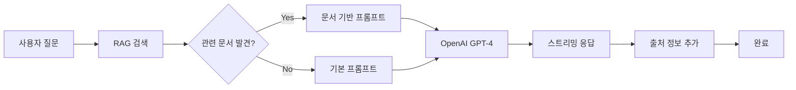

# HiDaddy 챗봇 - RAG 통합 버전

임신·출산·육아를 준비하는 아빠들을 위한 AI 챗봇 서비스입니다. RAG(Retrieval-Augmented Generation) 기술을 통해 공식 기관 문서 기반의 신뢰할 수 있는 답변을 제공합니다.

## 🚀 주요 기능

- 📚 **공식 문서 기반 RAG**: 보건복지부, 식약처, 대한산부인과학회 등 공신력 있는 기관의 문서 활용
- 💬 **실시간 스트리밍 채팅**: WebSocket을 통한 즉시 응답
- 👨‍👩‍👶 **아빠 특화 조언**: 아빠 관점에서 필요한 정보와 실용적 조언 제공
- 🔗 **출처 투명성**: 모든 답변에 정확한 출처와 URL 제공
- 🎯 **지능형 문서 검색**: 질문 관련성 기반 자동 문서 필터링

## 📁 시스템 구조

```
HiDaddy-ChatBot/
├── chatbot.py              # FastAPI 웹소켓 서버 
├── upload_documents.py     # PDF 문서 업로드 스크립트 
├── rag/                    # RAG 모듈 
│   ├── __init__.py         # 패키지 초기화
│   ├── rag_service.py      # RAG 핵심 로직 
│   ├── document_loader.py  # PDF 전용 문서 처리 
│   ├── embeddings.py       # Pinecone 업로드 
│   └── source_manager.py   # 출처 정보 관리 
├── data/
│   ├── sources.json        # 문서 출처 메타데이터
│   └── documents/          # PDF 문서 저장소 
└── requirements.txt        # 의존성 패키지
```

## 🛠 설치 및 설정

### 1. Python 가상환경 설정
```bash
python -m venv venv
source venv/bin/activate  # Linux/Mac
# 또는
venv\Scripts\activate     # Windows
```

### 2. 패키지 설치
```bash
pip install -r requirements.txt
```

### 3. 환경변수 설정
`.env` 파일을 생성하고 다음 정보를 입력하세요:

```env
# OpenAI API 설정
OPENAI_API_KEY=your_openai_api_key

# Pinecone 벡터 DB 설정
PINECONE_API_KEY=your_pinecone_api_key
PINECONE_HOST=your-index-host.pinecone.io
PINECONE_INDEX_NAME=hidaddy
PINECONE_NAMESPACE=pregnancy-guide

# 임베딩 모델
EMBEDDING_MODEL=text-embedding-3-small

# 서버 설정
PORT=8000
```

### 4. PDF 문서 업로드
```bash
# data/documents/ 폴더의 PDF들을 Pinecone에 업로드
python upload_documents.py --data_dir data/documents

# 사용자 정의 설정
python upload_documents.py --data_dir data/documents --namespace pregnancy-guide --chunk_size 1200
```

## 🎯 실행 방법

### 개발 환경
```bash
python chatbot.py
```

### 프로덕션 환경
```bash
uvicorn chatbot:app --host 0.0.0.0 --port 8000
```

### API 엔드포인트
```bash
# 헬스체크
curl http://localhost:8000/health

# 기본 정보
curl http://localhost:8000/

# WebSocket 채팅
ws://localhost:8000/ws/chat
```

## 📚 문서 관리

### 지원하는 문서 형식
- **PDF만 지원**: 공식 기관 문서의 정확성을 위해 PDF 전용으로 최적화

### 새 PDF 문서 추가
1. `data/documents/` 폴더에 PDF 파일 추가
2. `data/sources.json`에 출처 정보 등록:
   ```json
   {
     "문서파일명.pdf": {
       "official_title": "공식 문서 제목",
       "publisher": "발행기관",
       "date": "2024년",
       "url": "https://공식사이트.com/문서링크"
     }
   }
   ```
3. 업로드 스크립트 실행:
   ```bash
   python upload_documents.py --data_dir data/documents
   ```

### 현재 포함된 문서들
- **보건복지부**: 임신 사전건강관리 지원사업안내
- **식품의약품안전처**: 임산부 의약품 사용법 안내
- **대한산부인과학회**: 임산부 비만관리 가이드, 고위험임신 분류
- **질병관리청**: 예방접종 가이드
- **한국보건산업진흥원**: 임산부 영양관리

## ⚙️ RAG 시스템 동작 원리



### 상세 프로세스
1. **벡터 검색**: OpenAI `text-embedding-3-small`로 질문 임베딩 생성
2. **유사도 필터링**: Pinecone에서 유사도 0.4 이상인 문서만 선택
3. **컨텍스트 구성**: 선택된 문서 내용을 프롬프트에 포함
4. **GPT-4 호출**: 1200자 청크, 150자 중복으로 세분화된 정보 활용
5. **출처 표시**: 답변 완료 후 자동으로 출처 정보와 URL 제공

## 🔧 핵심 설정값

```python
# RAG 검색 설정
SIMILARITY_THRESHOLD = 0.4      # 유사도 임계값
TOP_K = 3                       # 검색할 문서 수
CHUNK_SIZE = 1200              # 텍스트 청킹 크기
CHUNK_OVERLAP = 150            # 청크 간 중복 크기

# OpenAI 설정
MODEL = "gpt-4-0613"           # GPT 모델
TEMPERATURE = 0.7              # 창의성 조절
MAX_TOKENS = 500               # 응답 길이 제한
```